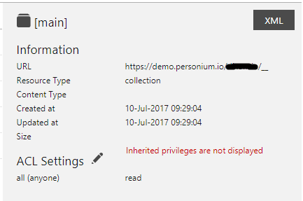
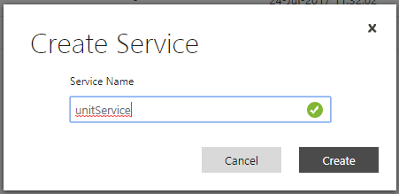
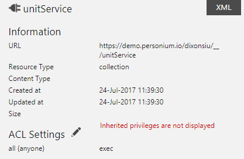
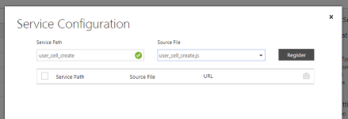
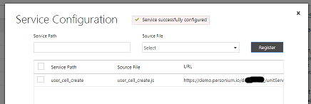

# Personal Cell Creator  

このサンプルを任意のCellに配備することで、ブラウザから新しいCellを作成することができます。
現状の実装は無認証で作成可能になるので、アクセス権限等ご利用の際はご注意ください。

なお、機能をより改善したバージョンも随時更新します。

## セットアップ

### 必要な情報

1. UnitAdminセルのURL (https://deployedDomainName/deployedCellName/
1. UnitAdminセル名 (targetUnitAdminCellName)  
1. UnitAdminアカウント (targetUnitAdminAccountName)
1. 上記UnitAdminアカウントのパスワード (targetUnitAdminAccountPassword)

### 手順
一部の作業はUnitManagerで実施必要です。  

1. 下記を実施してClientモジュールを適用してください。  
    1. [Clientスクリプト](./src/js/common.js)に上記必要な情報の環境依存値を設定する。  
        - deployedDomainName  
        - deployedCellName  
    1. src フォルダ配下のファイル（下記と同じフォルダ構成で）をメインBox配下に配置する。  
        - create.html  
        - css/common.css  
        - js/common.js  
        - locales/en/translation.json  
        - locales/ja/translation.json  
    1. メインBoxのアクセス権限（例： allユーザにRead）を設定する。  
        1. メインBox配下に移動  
        1. ACL Settings の編集アイコンをクリックし、all (anyone)のアクセス権限をReadに設定する  
        1. Saveボタンをクリックして設定を有効にする    
        正しい設定したの画面  
          
1. 下記を実施してEngineスクリプトを適用してください。  
    1. [Engineスクリプト](./src/unitService/__src/user_cell_create.js)に上記必要な情報の環境依存値を設定する。  
        - targetDomainName (deployedDomainNameを流用)  
        - targetUnitAdminCellName  
        - targetUnitAdminAccountName  
        - targetUnitAdminAccountPassword  
    1. メインBoxにサービス（サービス名：unitService）として登録する。  
      
    1. 下記のファイルを作成したサービス（unitService）の __src 配下に配置する。  
        - src/unitService/__src/user_cell_create.js  
    1. サービスの実行権限（例： allユーザにRead）を設定する。  
        1. メインBox配下に移動  
        1. unitServerを選択（チェックを入れる）  
        1. ACL Settings の編集アイコンをクリックし、all (anyone)の実行権限をExecに設定する  
        1. Saveボタンをクリックして設定を有効にする  
        正しい設定したの画面  
          
    1. サービスパス（user_cell_create）の設定。  
        1. メインBox配下に移動  
        1. unitServerを選択（チェックを入れる）  
        1. 表の左上のConfiugreメニューをクリック  
        1. サービスパス (user_cell_create) とファイル (user_cell_create.js)を指定する  
          
        1. Registerボタンをクリックして設定を登録する  
        正しい設定したの画面  
         
1. Personal Cell Creatorを適用後のメインBoxのフォルダ構成。  
  
1. 以下にアクセスする

```
{UnitAdminCellのURL}/__/create.html
```

## License

	Licensed under the Apache License, Version 2.0 (the "License");
	you may not use this file except in compliance with the License.
	You may obtain a copy of the License at

	    http://www.apache.org/licenses/LICENSE-2.0

	Unless required by applicable law or agreed to in writing, software
	distributed under the License is distributed on an "AS IS" BASIS,
	WITHOUT WARRANTIES OR CONDITIONS OF ANY KIND, either express or implied.
	See the License for the specific language governing permissions and
	limitations under the License.

	Copyright 2017 FUJITSU LIMITED
